# back-manage

电商后台管理系统


# 1. 功能

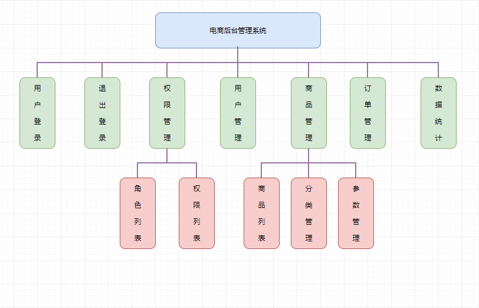

### 开发模式

> 电商后台管理系统整体采用前后端分离的开发模式,其中前端项目是基于Vue技术栈的SPA项目

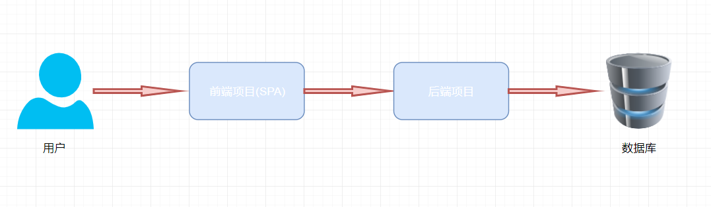

### 技术选型

- Vue
- Vue-router
- Element-UI
- Axios
- Echarts
- [API接口文档](./api接口文档.md)
- 后端API接口源码  [下载](https://gitee.com/wBekvam/vueShop-api-server.git)

> 此项目中使用的是api地址是：`https://lianghj.top:8888/api/private/v1/`
>
> 可以将后端源码下载下来跑通后使用本地的后端服务，此时需要修改`src/network/request.js`文件中的请求地址，也需要修改`src/components/goods/listChildComponents/ListAdd.vue`中上传图片的请求地址。

### 登录

- 项目默认登录名：admin，密码：123456
- 在登录页面输入用户名和密码
- 调用后台接口进行验证
- 通过验证之后,根据后台的响应状态跳转到项目主页

### 用户管理

系统用户列表

### 权限管理

通过权限管理模块控制不同的用户可以进行哪些操作，具体可以通过角色的方式进行控制，即每个用户分配一个特定的角色，角色包括不同的功能权限。

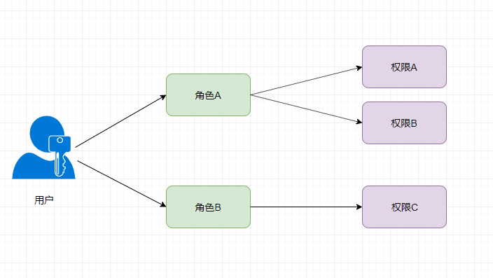

#### 角色列表

系统中角色列表。可以新增、编辑、删除、为角色分配权限。

#### 权限列表

当前系统可以操作的权限。

### 商品管理

#### 商品列表

所有商品的列表。可以添加、编辑、删除商品。

#### 分类参数

展示或者设置某款商品的参数，如尺寸、板式、颜色等。

#### 商品分类

商品分类用于在购物时，快速找到需要购买的商品，进行直观显示。

### 订单管理

当前系统中的所有订单。可以对订单进行编辑

### 数据统计

数据报表

# 2. 技术问题

## 登录功能
### 保存token

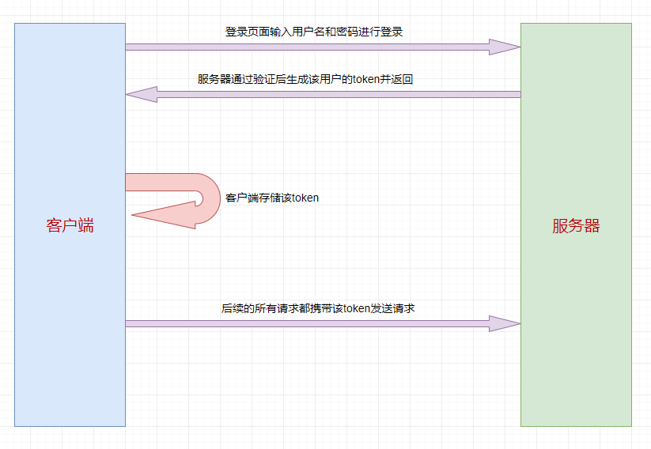

将登录成功之后的 token，保存到客户端的sessionStorage中。sessionStorage保存的数据用于浏览器的一次会话（session），当会话结束（通常是窗口关闭），数据会被清空
### 路由导航守卫控制访问权限
如果用户没有登录，但是直接通过URL访问特定页面，需要重新导航到登录页面。

```js
// 在配置路由的文件中配置

// 添加全局前置导航守卫
router.beforeEach((to,from,next) => {
  // 如果访问的是登录页，直接放行
  if (to.path === '/login') return next();
  // 从sessionStorage中取出token值
  let token = sessionStorage.getItem('token');
  // 如果token不存在，说明没有登录，就强制跳转到登录页
  if (!token) {
    return next('/login');
  }
  next();
});
```

## 退出功能

基于token的方式实现退出比较简单，只需要销毁本地的token即可。这样，后续的请求就不会携带token ，必须重新登录生成一个新的token之后才可以访问页面。

## 通过axios 请求拦截器添加token

项目中除了登录之外的其他API接口，必须在登录之后才能访问，登录之后可以获得token。**需要授权的 API ，必须在请求头中使用 `Authorization` 字段提供 `token` 令牌**。怎么做呢？

**通过axios 请求拦截器添加token，保证拥有获取数据的权限。**

```js
// 拦截请求。请求在到达服务器之前会首先调用这个函数对请求做一些预处理
axios.interceptors.request.use(config => {
   console.log('拦截请求', config);
   // 为请求头对象添加Token验证的Authorization字段
   config.headers.Authorization = sessionStorage.getItem('token');
   return config;
})
```

## 其它
- 适用于 Vue 的富文本编辑器：[Vue-Quill-Editor](https://github.com/surmon-china/vue-quill-editor)
- 进度条使用第三方库：[nprogress](https://github.com/rstacruz/nprogress) 在axios拦截请求时展示进度条，拦截响应时隐藏进度条
- 学习资料：https://www.bilibili.com/video/BV1x64y1S7S7

# 3. 项目预览

## 首页

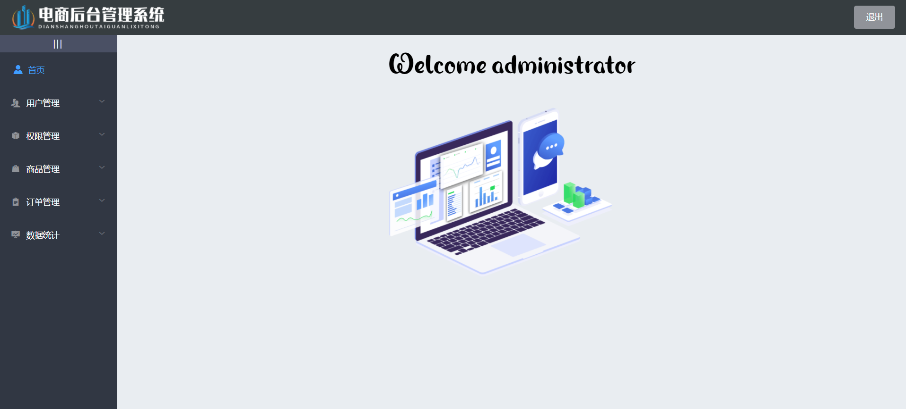

## 用户管理

## 用户列表

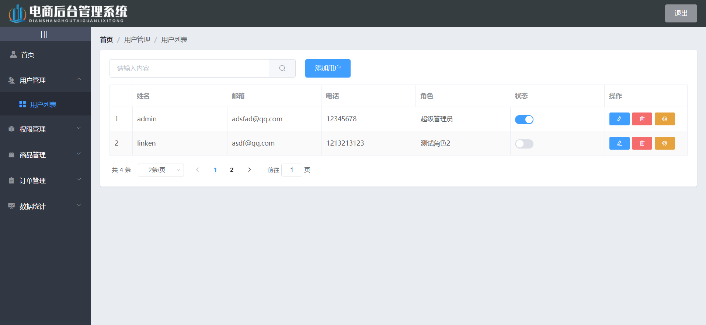

### 添加用户

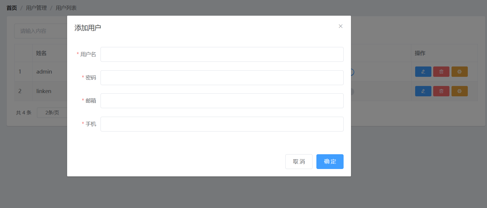

## 权限管理

### 角色列表

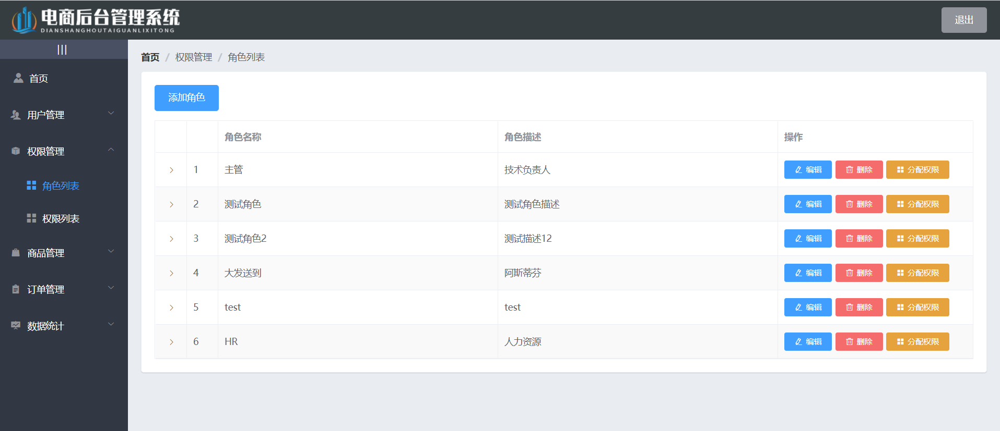

### 权限列表

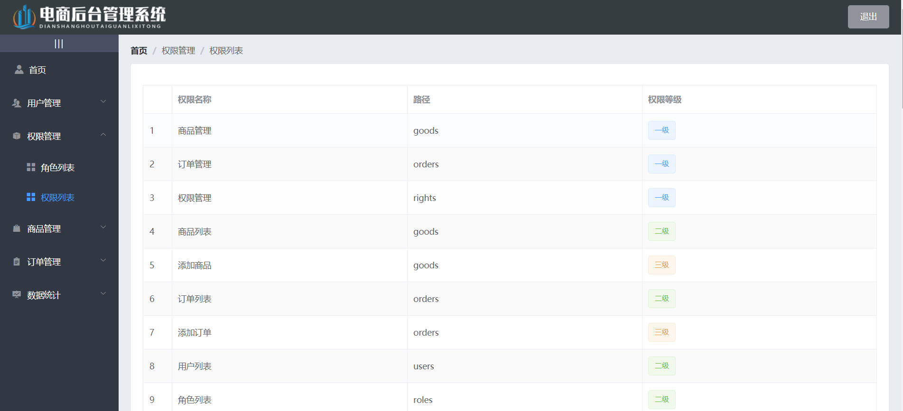

## 商品管理

### 商品列表

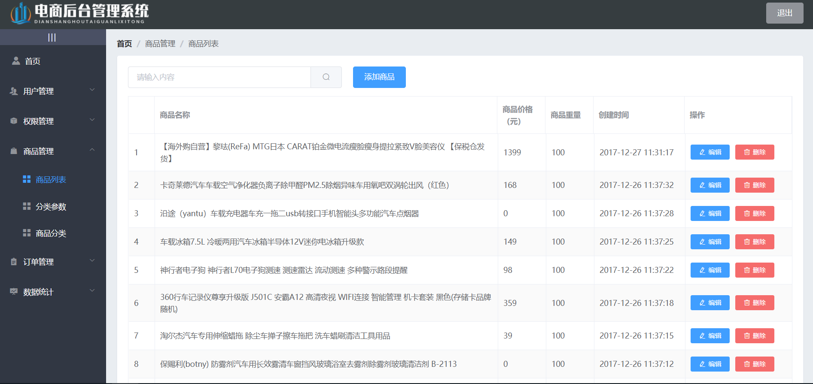

### 分类参数

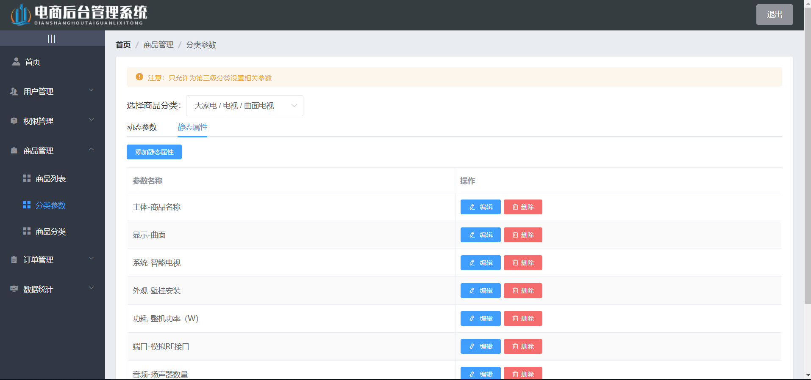

### 商品分类


## 订单管理

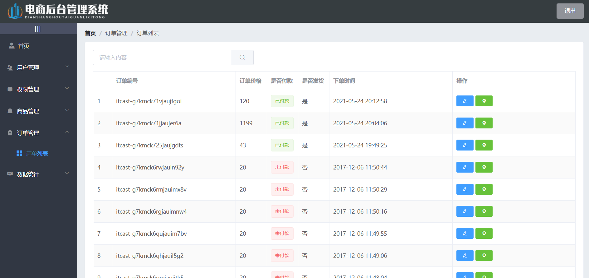

## 数据统计

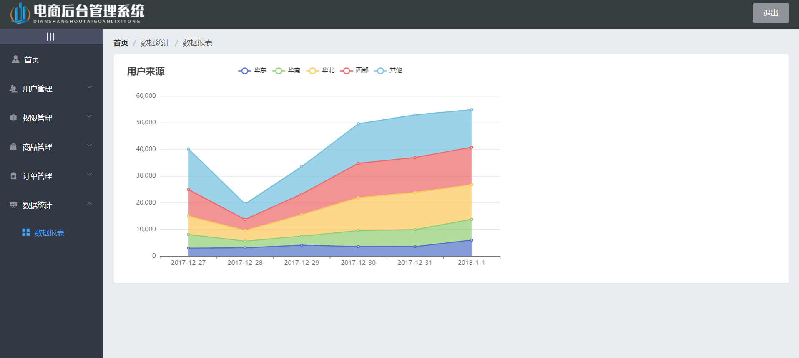
